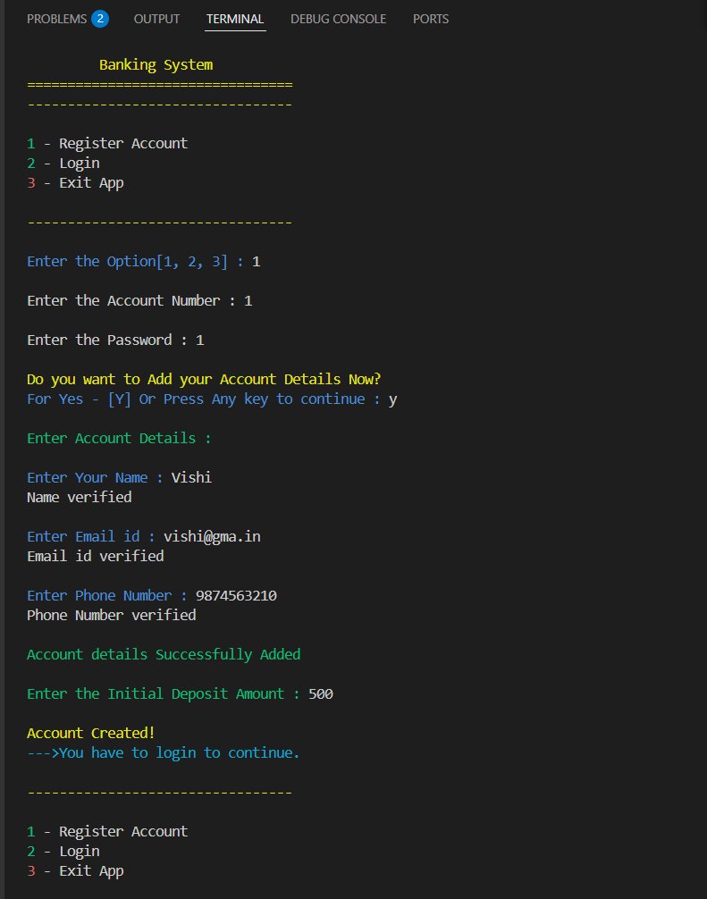
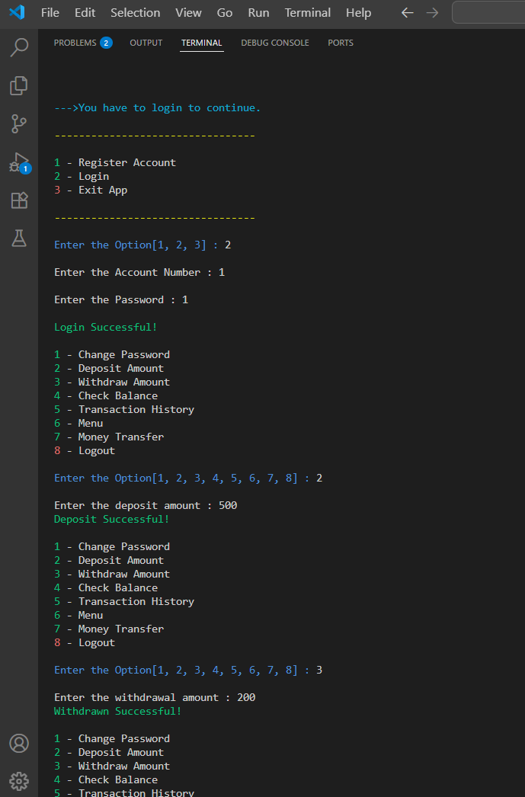
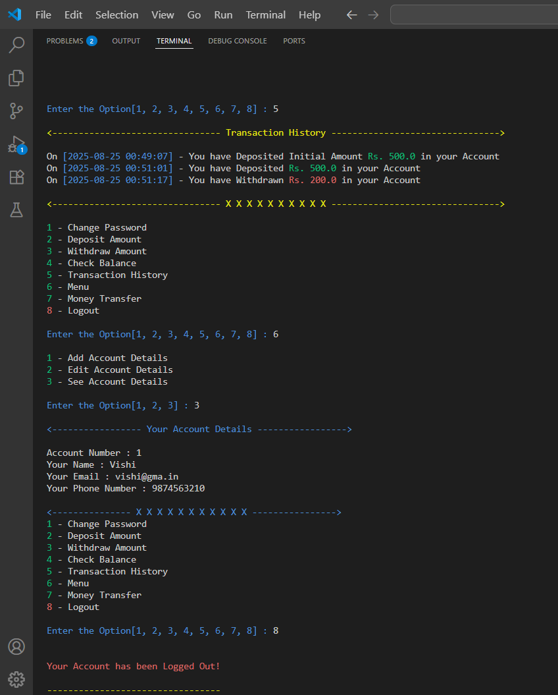

🏦 Banking System (Java + JDBC)

A simple console-based Banking System built with Java and MySQL (JDBC).
This project demonstrates how to implement core banking operations such as account registration, login, deposits, withdrawals, transfers, and transaction history with persistent storage in a MySQL database.

✨ Features : 

👤 User Registration & Login

🔑 Secure password management (change/update password)

💰 Deposit & Withdraw money

🔄 Money Transfer between accounts

📜 Transaction History tracking

📊 Account Details Management (add, edit, view)

✅ Input validation for account number, email, and phone number

🛠️ Tech Stack : 

Java 17+

MySQL Database

JDBC (Java Database Connectivity)

📂 Project Structure :

BankApp.java             # Main entry point
CheckUserDetails.java    # Input validation
CheckAccountDetails.java # Account info management
JdbcUserService.java     # Service layer (balance, password, activation)
JdbcUserDetails.java     # User info (name, email, phone)
JdbcServiceHistory.java  # Transaction history
UserService.java         # Account model
UserDetails.java         # User details model

⚙️ Setup Instructions :

1. Clone the Repository
git clone https://github.com/your-username/banking-system.git
cd banking-system

2. Database Setup

Create a database in MySQL:

CREATE DATABASE jdbcBank;
USE jdbcBank;

-- Service table

CREATE TABLE service (

    accNo INT PRIMARY KEY,

    balance DOUBLE NOT NULL,

    password VARCHAR(100) NOT NULL,

    isActive INT DEFAULT 0

);

-- User details table

CREATE TABLE user (

    accNo INT PRIMARY KEY,

    name VARCHAR(50),

    email VARCHAR(50),

    phoneNo VARCHAR(15)

);

-- Transaction history table

CREATE TABLE TransHistory (

    transId INT AUTO_INCREMENT PRIMARY KEY,

    accNo INT,

    type VARCHAR(50),

    amount DOUBLE,

    balance DOUBLE,

    targetAccNo INT,

    transDate TIMESTAMP DEFAULT CURRENT_TIMESTAMP

);

3. Update Database Credentials

In files like JdbcUserService.java, JdbcUserDetails.java, JdbcServiceHistory.java update:

String url = "jdbc:mysql://localhost:3306/jdbcBank?useSSL=false&serverTimezone=UTC";

Connection con = DriverManager.getConnection(url, "root", "YOUR_PASSWORD");

4. Run the Application

Compile and run:

javac BankApp.java
java BankApp

🎮 Usage :

Register an account with account number, password, and initial deposit.

Login using account number & password.

Access the menu to:

Change password

Deposit / Withdraw money

Transfer money

Check balance

View transaction history

Manage account details

🚀 Future Improvements : 

🔒 Password hashing for security

🌐 Web-based UI using Spring Boot

📱 Mobile app integration

📊 Admin dashboard for managing accounts

---

## 📸 Demo Screenshots : 

### 1️⃣ Main Menu

### 2️⃣ Banking Operation

### 3️⃣ History and Account details

